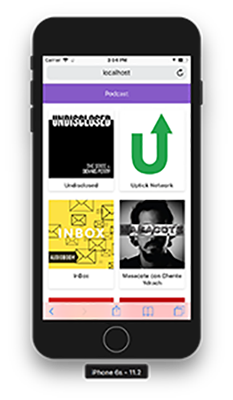

# App de Podcast de platzi

App de podcast integrada con la api de Audioboom para curso de Next.js

## ¿Cómo funciona?

Reuire Node.js 10

* `yarn install` para instalar las dependencias.
* `yarn run dev` para entorno de desarrollo
* `yarn run build && yarn start` para el entorno de producción

## Licencia

MIT
